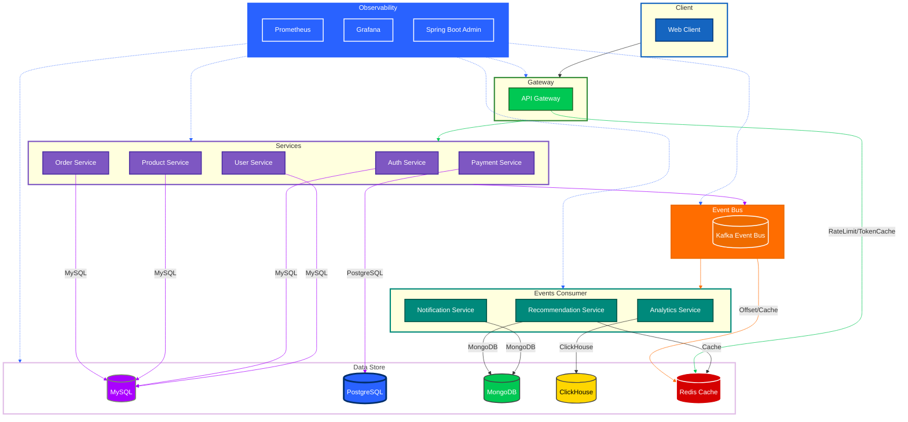

# ShopVerse – Intelligent Event-Driven E-Commerce Platform

[](https://opensource.org/licenses/MIT)

[//]: # ([![Build Status]&#40;https://github.com/yourusername/ShopVerse/actions/workflows/build.yml/badge.svg&#41;]&#40;https://github.com/yourusername/ShopVerse/actions&#41;)
[](https://www.docker.com/)

## 🚀 Overview

ShopVerse is a modern, data-driven e-commerce platform built with a microservices architecture. It leverages Spring Boot, Kafka, and React to deliver real-time analytics, personalized recommendations, and automated batch product processing in a scalable, event-driven ecosystem.

## ✨ Key Features

- **Microservices Architecture**: Independently deployable services with dedicated databases
- **Event-Driven Design**: Real-time event processing with Apache Kafka
- **User Authentication**: Secure JWT-based authentication
- **Product Management**: Bulk product ingestion with real-time job tracking
- **Payment Processing**: Integrated Razorpay payment gateway
- **Real-time Analytics**: Live dashboards with business insights
- **Personalized Recommendations**: AI/ML-powered product suggestions
- **Notification System**: Real-time user notifications
- **Containerized Deployment**: Docker and Docker Compose support

## 🏗️ System Architecture



### Architecture Components

1. **Client Layer**
   - Web and Admin interfaces
   - Communicates via HTTPS with API Gateway

2. **API Gateway**
   - Single entry point for all client requests
   - Request routing, load balancing, and security
   - Caching with Redis

3. **Core Services**
   - **Auth Service**: JWT-based authentication & authorization
   - **User Service**: User profiles and management
   - **Product Service**: Product catalog and inventory
   - **Order Service**: Order processing and management
   - **Payment Service**: Payment processing integration

4. **Event-Driven Services**
   - **Notification Service**: Real-time user notifications
   - **Analytics Service**: Business intelligence and reporting
   - **Recommendation Service**: Personalized product suggestions

5. **Data Layer**
   - **MySQL**: Core transactional data (users, orders)
   - **PostgreSQL**: Payment transactions and financial data
   - **MongoDB**: Product catalog and user profiles (flexible schema)
   - **ClickHouse**: High-performance analytics and reporting
   - **Redis**: Caching, session management, and rate limiting
   - **Elasticsearch**: Product search and recommendations

6. **Monitoring & Operations**
   - Spring Boot Admin for service monitoring
   - Prometheus for metrics collection
   - Grafana for visualization

7. **Message Broker**
   - Apache Kafka for event streaming between services
   - Enables loose coupling and scalability

## 🛠️ Tech Stack

- **Backend**: Java 21, Spring Boot 3.x +, Spring Cloud
- **Frontend**: React.js, Redux, Tailwind CSS
- **Database**: MySQL, MongoDB, PostgreSQL, ClickHouse, Redis (Caching)
- **Message Broker**: Apache Kafka, Apache Flink
- **Service Discovery**: Spring Cloud Netflix Eureka
- **API Gateway**: Spring Cloud Gateway
- **Authentication**: JWT, Spring Security
- **Payment Processing**: Razorpay Integration
- **Containerization**: Docker, Docker Compose
- **CI/CD**: GitHub Actions
- **Monitoring**: Spring Boot Actuator, Spring Boot Admin, Prometheus, Grafana

## 🚀 Quick Start

### Prerequisites

- Docker & Docker Compose
- Java 21 or higher
- Git

### One-Command Setup

1. **Clone and prepare the repository**
   ```bash
   git clone https://github.com/yourusername/ShopVerse.git
   cd ShopVerse-Backend
   ```

2. **Run the setup script**
   ```bash
   # Make the script executable
   chmod +x scripts/setup.sh
   
   # Run the setup script
   ./scripts/setup.sh
   ```

   The setup script will automatically:
   - Start all required infrastructure (Kafka, ClickHouse, PostgreSQL, MySQL, Redis, MongoDB)
   - Build all microservices
   - Start services in the correct order with proper health checks
   - Display the status of all services

3. **Access the applications**
   - API Gateway: http://localhost:8080
   - Eureka Dashboard: http://localhost:8761
   - Admin Dashboard: http://localhost:8080/admin

### Manual Setup (Alternative)

If you prefer to run services manually:

```bash
# 1. Start infrastructure
cd ShopVerse-Backend
docker-compose up -d kafka zookeeper mysql redis mongodb

# 2. Build and start services (in separate terminals)
cd discovery-service && ./gradlew bootRun
cd ../gateway && ./gradlew bootRun
# Repeat for other services...
```

## 🛠️ Available Services

| Service                    | Port | Description                             |
|----------------------------|------|-----------------------------------------|
| **api-gateway**            | 8080 | API Gateway (Spring Cloud Gateway)      |
| **discovery-service**      | 8761 | Service Registry (Eureka)               |
| **admin-server**           | 8079 | Spring Boot Admin (Monitering) |
| **auth-service**           | 8081 | Authentication & Authorization          |
| **user-service**           | 8082 | User Management                         |
| **product-service**        | 8083 | Product Catalog                         |
| **order-service**          | 8084 | Order Processing                        |
| **payment-service**        | 8085 | Payment Processing                      |
| **notification-service**   | 8086 | Real-time Notifications                 |
| **analytics-service**      | 8087 | Business Analytics                      |
| **recommendation-service** | 8088 | Product Recommendations                 |

## 🔧 Troubleshooting

### Common Issues

1. **Port conflicts**
   - Ensure no other services are running on the required ports (8080, 8761, etc.)
   - Check running containers: `docker ps`

2. **Setup script fails**
   - Make sure Docker is running
   - Check available disk space
   - Increase Docker memory allocation if needed
   - View logs in `logs/` directory

3. **Service not starting**
   - Check service logs in `logs/service-name.log`
   - Verify database connection
   - Ensure Kafka is running: `docker-compose ps kafka`

### Logs

View logs for all services in the `logs/` directory:

```bash
# View logs for a specific service
tail -f logs/gateway.log

# View all logs
tail -f logs/*.log
```

## ⚙️ Configuration

### Environment Variables

The application is pre-configured with sensible defaults. To customize, create a `.env` file in the root directory:

```env
# Database (MySQL)
MYSQL_ROOT_PASSWORD=rootpass
MYSQL_DATABASE=shopverse
MYSQL_USER=shopuser
MYSQL_PASSWORD=shoppass

# JWT Authentication
JWT_SECRET=change_this_to_a_secure_secret
JWT_EXPIRATION=86400000  # 24 hours

# Kafka
KAFKA_BOOTSTRAP_SERVERS=kafka:9092

# Redis
REDIS_HOST=redis
REDIS_PORT=6379

# MongoDB
MONGO_URI=mongodb://mongodb:27017/shopverse

# Razorpay (for payment-service)
RAZORPAY_KEY_ID=your_razorpay_key
RAZORPAY_KEY_SECRET=your_razorpay_secret
```

> **Note**: The setup script will automatically create this file with default values if it doesn't exist.

## 🧪 Testing

Run tests for all services:

```bash
# Run tests for all services
./gradlew test

# Run tests for a specific service
cd <service-directory>
./gradlew test
```

## 🐳 Docker Deployment

Build and run the entire application stack:

```bash
docker-compose up -d --build
```

## 📈 Monitoring

- **Spring Boot Actuator**: http://localhost:8080/actuator
- **Spring Boot Admin**: http://localhost:8079
- **Prometheus**: http://localhost:9090
- **Grafana**: http://localhost:3000 (default: admin/admin)

## 🤝 Contributing

1. Fork the repository
2. Create your feature branch (`git checkout -b feature/AmazingFeature`)
3. Commit your changes (`git commit -m 'Add some AmazingFeature'`)
4. Push to the branch (`git push origin feature/AmazingFeature`)
5. Open a Pull Request

## 📄 License

This project is licensed under the MIT License - see the [LICENSE](LICENSE) file for details.

## 🙏 Acknowledgments

- Spring Boot Team
- Apache Kafka
- Docker Community
- All open-source contributors

---

<div align="center">
  Made with ❤️ by ShopVerse Team | 2025-26
</div>
