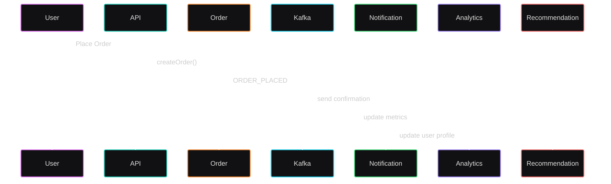

# 🔁 Event Lifecycle – ShopVerse Platform

This document describes the **end-to-end lifecycle of events** in the ShopVerse microservices ecosystem.

Events are the backbone of:
- Notifications
- Analytics
- Recommendations
- Audit & observability

The system follows an **event-driven architecture using Kafka**.

---

## 🧠 Why Event Lifecycle Matters

Event-driven systems provide:
- Loose coupling between services
- Horizontal scalability
- Real-time processing
- Replayability for analytics and ML

---

## 🏗️ Core Event Infrastructure

```mermaid
---
config:
  layout: fixed
---
flowchart LR
    Services["Services"] --> Kafka[("Kafka Topics")]
    Kafka L_Kafka_Notification_0@--> Notification["Notification"] & Analytics["Analytics"] & Recommendation["Recommendation"]

     Services:::services
     Kafka:::kafka
     Notification:::notification
     Analytics:::analytics
     Recommendation:::recommendation
    classDef services fill:#4FC3F7,stroke:#0288D1,stroke-width:2px
    classDef kafka fill:#FFD54F,stroke:#FFA000,stroke-width:2px
    classDef notification fill:#CE93D8,stroke:#6D4C41,stroke-width:2px
    classDef analytics fill:#AED581,stroke:#558B2F,stroke-width:2px
    classDef recommendation fill:#FFAB91,stroke:#D84315,stroke-width:2px
    style Services fill:#2962FF
    style Kafka fill:#FFD600
    style Notification fill:#AA00FF
    style Analytics fill:#00C853
    style Recommendation fill:#FF6D00

    L_Kafka_Notification_0@{ curve: natural } 
    L_Kafka_Recommendation_0@{ curve: natural }
````

---

## 🧩 Event Categories

| Category           | Purpose                          |
| ------------------ | -------------------------------- |
| User Events        | Authentication & profile actions |
| Product Events     | Catalog changes                  |
| Order Events       | Purchase lifecycle               |
| Payment Events     | Financial transactions           |
| Interaction Events | User behavior                    |

---

## 1️⃣ User Event Lifecycle

### 🔹 USER_REGISTER

**Triggered by**

* Auth Service (after user creation)

**Produced Event**

```json
{
  "eventType": "USER_REGISTER",
  "service": "auth",
  "userEmail": "user@email.com",
  "timestamp": "2026-01-02T10:00:00"
}
```

**Kafka Topic**

```
user-events
```

**Consumed By**

| Service        | Action                  |
| -------------- | ----------------------- |
| Notification   | Send welcome message    |
| Analytics      | Count new users         |
| Recommendation | Initialize user profile |

---

### 🔹 USER_LOGIN

**Triggered by**

* Auth Service on successful login

**Consumed By**

| Service        | Purpose                  |
| -------------- | ------------------------ |
| Notification   | Login alert              |
| Analytics      | DAU/MAU                  |
| Recommendation | Boost recent preferences |

---

## 2️⃣ Product Event Lifecycle

### 🔹 PRODUCT_CREATED / UPDATED

**Triggered by**

* Product Service (admin action)

**Kafka Topic**

```
product-events
```

**Consumed By**

| Service        | Action             |
| -------------- | ------------------ |
| Notification   | Admin activity log |
| Analytics      | Catalog growth     |
| Recommendation | Refresh embeddings |

---

## 3️⃣ Order Event Lifecycle

### 🔹 ORDER_PLACED

**Triggered by**

* Order Service after order creation

**Event Payload**

```json
{
  "eventType": "ORDER_PLACED",
  "service": "order",
  "userEmail": "user@email.com",
  "entityId": "ORDER123",
  "timestamp": "2026-01-02T12:15:00"
}
```

**Kafka Topic**

```
order-events
```

**Consumed By**

| Service        | Action                    |
| -------------- | ------------------------- |
| Notification   | Order confirmation        |
| Analytics      | Order metrics             |
| Recommendation | Reduce bought item weight |

---

## 4️⃣ Payment Event Lifecycle

### 🔹 PAYMENT_SUCCESS / FAILED

**Triggered by**

* Payment Service

**Kafka Topic**

```
payment-events
```

**Consumed By**

| Service        | Purpose                 |
| -------------- | ----------------------- |
| Notification   | Payment status          |
| Analytics      | Revenue                 |
| Recommendation | High-value user scoring |

---

## 5️⃣ User Interaction Event Lifecycle

### 🔹 PRODUCT_VIEWED / ADD_TO_CART

**Triggered by**

* Frontend or API Gateway

**Kafka Topic**

```
interaction-events
```

**Consumed By**

| Service        | Action                    |
| -------------- | ------------------------- |
| Recommendation | Real-time personalization |
| Analytics      | Funnel analysis           |

---

## 🔄 Complete Event Flow Example



---

## ⚡ Event Guarantees

| Feature                | Support           |
| ---------------------- | ----------------- |
| At-least-once delivery | ✅ Kafka           |
| Ordering per key       | ✅ userEmail       |
| Replay capability      | ✅ Kafka           |
| Backpressure handling  | ✅ Consumer groups |

---

## 🛡️ Failure & Recovery

* Kafka retains events
* Consumers can restart safely
* Dead-letter topics recommended
* Idempotent consumers preferred

---

## 🔐 Security & Trust

* Events contain **minimal PII**
* Authorization enforced at API Gateway
* Internal services trust Kafka events

---

## 🧠 Interview One-Liner

> “Every important business action emits a Kafka event which is consumed independently by analytics, notifications, and recommendations.”

---

## 🚀 Future Enhancements

* Schema Registry (Avro/Protobuf)
* Event versioning
* Event sourcing
* Stream processing (Flink)
* ML pipelines